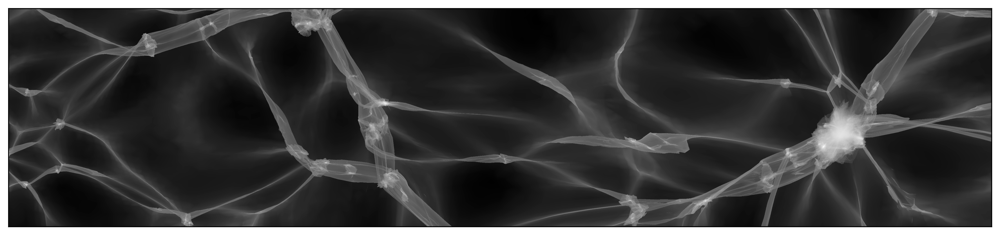

# PhaseSpaceDTFE
[](https://jfeldbrugge.github.io/PhaseSpaceDTFE.jl/stable/)
[](https://jfeldbrugge.github.io/PhaseSpaceDTFE.jl/dev/)
[](https://github.com/jfeldbrugge/PhaseSpaceDTFE.jl/actions/workflows/CI.yml?query=branch%3Amain)
[](https://codecov.io/github/jfeldbrugge/PhaseSpaceDTFE.jl)


<figure>
<a href='docs/src/assets/figures/density.png'></a>
</figure>

The density and velocity fields of an N-body simulation are estimated with the Phase-Space Delaunay Tessellation Field Estimator implemented in Julia. This code accompanies the publication [Phase-Space Delaunay Tesselation Field Estimator](https://academic.oup.com/mnras/article/536/1/807/7915986).

## Installation

The PhaseSpaceDTFE package can be installed with the Julia package manager.
From the Julia REPL, type `]` to enter the Pkg REPL mode and run:

```julia
pkg> add PhaseSpaceDTFE
```

Or, equivalently, via the `Pkg` API:

```julia
julia> import Pkg; Pkg.add("PhaseSpaceDTFE")
```

## Usage
Given the initial (`coords_q`) and final (`coords_x`) particle positions and velocities `vels` of an $N$-body simulation, we estimate the density, velocity and number of streams fields as follows:

```julia
using PhaseSpaceDTFE

m       = 1.  # particle mass
depth   = 5
sim_box = SimBox(L, Ni)

ps_dtfe_sb = ps_dtfe_subbox(coords_q, coords_x, vels, m, depth, sim_box)

Range      = 0.:0.2:100.
coords_arr = [[L/2., y, z] for y in Range, z in Range]
density_field  = density_subbox(coords_arr, ps_dtfe_sb)
nstreams_field = numberOfStreams_subbox(coords_arr, ps_dtfe_sb)
velocity_field = velocitySum_subbox(coords_arr, ps_dtfe_sb)
```

Please have a look at the Documentation for more details.

## Contributors
This code was written by:
* Job Feldbrugge ([job.feldbrugge@ed.ac.uk](mailto:job.feldbrugge@ed.ac.uk))
* Benjamin Hertzsch ([benjamin.hertzsch@ed.ac.uk](mailto:benjamin.hertzsch@ed.ac.uk))

We thank:
* Bram Alferink


## Citations
When using this code in work, please cite

```
@article{Feldbrugge2024,
    author = {Feldbrugge, Job},
    title = {Phase-space Delaunay tessellation field estimator},
    journal = {Monthly Notices of the Royal Astronomical Society},
    volume = {536},
    number = {1},
    pages = {807-815},
    year = {2024},
    month = {12},
    issn = {0035-8711},
    doi = {10.1093/mnras/stae2627},
    url = {https://doi.org/10.1093/mnras/stae2627},
    eprint = {https://academic.oup.com/mnras/article-pdf/536/1/807/61019429/stae2627.pdf},
}

@misc{FeldbruggeHertzsch2025,
  author = {Feldbrugge, Job and Hertzsch, Benjamin},
  title={PhaseSpaceDTFE.jl -- Julia implementation of the Phase-Space Delaunay Tessellation Field Estimator},
  year={2025},
  month={aug}
  doi={10.5281/zenodo.16637561},
  url={http://dx.doi.org/10.5281/zenodo.16637561}
}
```

and the additional references listed in the citation section of the documentation.