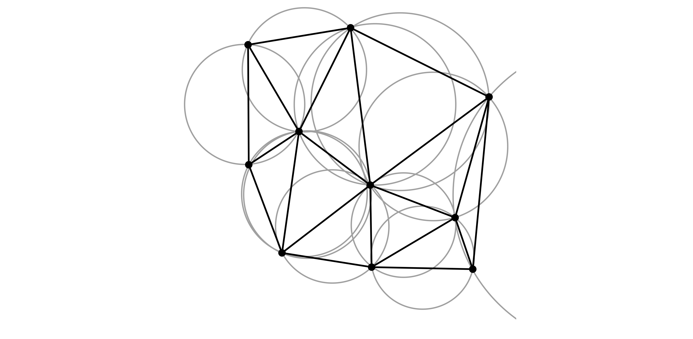

```@meta
CurrentModule = PhaseSpaceDTFE
```

# Theory
The Delaunay Tessellation Field Estimator (DTFE) and its extension to phase-space (PS-DTFE) are mathematical tool for the reconstruction of the density and velocity field of a discrete point set. We here review the derivations underlying these reconstruction methods.

## The Delaunay Tessellation Field Estimator
Delaunay Tessellation Field Estimator (DTFE) is a mathematical tool for the reconstruction of the density and velocity field of a discrete point set developed by Willem Schaap and Rien van de Weijgaert ([Schaap and Weijgaert 2004](https://www.astro.rug.nl/~weygaert/tim1publication/weyval2004.pdf), [Willem Schaap 2007](https://web.archive.org/web/20071210093614/http://dissertations.ub.rug.nl/faculties/science/2007/w.e.schaap/?FullItemRecord=ON)). The DTFE method dynamically adapts to the variation of the density and geometry of the point set. The method is used in cosmological datasets (see for example [the astronomy picture of the day, 7 November 2007](https://apod.nasa.gov/apod/ap071107.html)) as it can simultaneously capture the geometry of the voids, walls, filaments and clusters and preserve the total mass of the pointset. The total mass is not preserved in the closely related 
[natural neighbor interpolation](https://en.wikipedia.org/wiki/Natural_neighbor_interpolation) based on the Voronoi tessellation. For an efficient implementation of the DTFE method in c++ see the [code by Marius Cautun](https://github.com/MariusCautun/DTFE).

Consider the pointset $\mathcal{P}$ consisting of $N$ labaled points $p_i \in \mathbb{R}^d$, the velocity set $\mathcal{V}$ consisting of the $N$ velocities $v_i \in \mathbb{R}^d$, and the mass set $\mathcal{M}$ consisting of the masses $m_i \in \mathbb{R}$ corresponding to the points in $\mathcal{P}$, with $i=1,\dots,N$. Using the points, we reconstruct the density field $\rho:\mathbb{R}^d \to \mathbb{R}$. Using both the points and the velocities, we construct the velocity field $v:\mathbb{R}^d\to \mathbb{R}$.

### Density reconstruction
Given the pointset $\mathcal{P}$, consider the Delaunay tesselation $\mathcal{D}$ consisting of $N_T$ labelled simplices $D_i$, with $i=1,\dots, N_T$. In two dimensions, a simplex is a triangle spanning three points in $\mathcal{P}$. In three dimensions, a simplex is a tetrahedron spanning four points in $\mathcal{P}$.



Let's assume we can associate a (to be determined) density estimate $\rho_i$ to each point in $\mathcal{P}$. Given a symplex $D \in \mathcal{D}$ spanned by the vertices $p_{l_0},\dots, p_{l_d} \in \mathcal{P}$, with the corresponding densities $\rho_{l_0}, \dots, \rho_{l_d}$, we construct a linear interpolation of the density field in the simplex 

```math
\rho(x) = \rho_{l_0} + [\nabla \rho] (x-p_{l_0}),
```

with $x \in D$ and the gradient vector $\nabla \rho\in \mathbb{R}^d$ associated to the simplex determined by the $d$ linear consistency relations $\rho(p_{l_i}) = \rho_{l_i}$ for $i=1,\dots,d$. In matrix notation,

```math
\nabla \rho = 
\begin{pmatrix}
p_{l_1}-p_{l_0}\\
\vdots\\
p_{l_d}-p_{l_0}\\
\end{pmatrix}^{-1}
\begin{pmatrix}
\rho_1-\rho_0\\
\vdots\\
\rho_d-\rho_0\\
\end{pmatrix}.
```

This system of equations is solvable when non of the points $p_{l_0}, \dots, p_{l_d}$ are collinear. The integral over the linear interpolation yields

```math
\int_D \rho(x)\mathrm{d}x = \frac{V(D)}{d+1} \sum_{i \in D} \rho_i ,
```

with $V(D)$ the volume of the simplex $D$ and $i$ the labels of the vertices of $D$ in $\mathcal{P}$. Note that the volume of a simplex $D$ spanned by $p_{l_0}, \dots, p_{l_d}$ can be expressed as the determinant

```math
V(D) = \frac{1}{d!}
\begin{vmatrix}
p_{l_1}-p_{l_0}\\
\vdots\\
p_{l_d}-p_{l_0}\\
\end{vmatrix}.
```

The integral over density -- assuming the density vanishes outside of the convex hull of the Delaunay tesselation -- takes the form

```math
\begin{align}
\int \rho(x) \mathrm{d}x 
&= \sum_{i=1}^{N_T} \int_{D_i} \rho(x)\mathrm{d}x\\
&= \frac{1}{d+1} \sum_{i=1}^{N_T} V(D_i) \sum_{j \in D_i} \rho_j,
\end{align}
```

where the first sum runs over the simplices of the tessellation and the second sum runs over the vertices of a given simplex. Note that $\rho_i$ enters the sum for each simplex for which it is a vertex. These simplices form the star $W_i$ of the point $p_i$


Using this observation, we reorder the double sum, by collecting the terms involving $\rho_i$ leading to the terms $\rho_i(V(D_{l_0}) + \dots + V(D_{l_n})) = \rho_i V(W_i)$, with the $D_{l_i}$'s forming the star of $p_i$. The integral over the density is now a single sum over the points in $\mathcal{P}$, *i.e.,*

```math
\int \rho(x) \mathrm{d}x =\frac{1}{d+1} \sum_{i=1}^N \rho_i V(W_i).
```

The key observation in DTFE is that when we chose the natural estimate of the density,

```math
\rho_i = \frac{(d+1) m_i}{V(W_i)},
```

by which the density at $p_i$ only depends on the mass at the point and the local geometry, the integral over the density reduces to the total mass of the point set

```math
\int \rho(x)\mathrm{d}x = \sum_{i=1}^N m_i
```

as one might expect of a density reconstruction method.

Now, given a point $x \in \mathbb{R}^d$, we can reconstruct the density field at this point by finding the simplex in which the point lays and evaluating the linear interpolation of the density in the simplex.

### Velocity reconstruction
The velocity field of the dataset can be analogously reconstructed reconstructed with an linear interpolation in the Delaunay cells. Given a simplex $D$ spanned by the vertices $p_{l_0}, \dots, p_{l_d}$ and the associated velocities $v_{l_0},\dots,v_{l_d}$, we write the velocity field in the simplex $D$ as

```math
v(x) = v_{l_0} + \nabla v (x - p_{l_0})
```

with the velocity gradient $\nabla v$ associated to the simplex determined by the linear consistency relations $v(p_{l_i}) = v_{l_i}$ for $i=1,\dots,d$. In matrix notation,

```math
\nabla v = 
\begin{pmatrix}
p_{l_1}-p_{l_0}\\
\vdots\\
p_{l_d}-p_{l_0}\\
\end{pmatrix}^{-1}
\begin{pmatrix}
v_1-v_0\\
\vdots\\
v_d-v_0\\
\end{pmatrix}.
```

Now, given a point $x \in \mathbb{R}^d$, we can reconstruct the velocity field at this point by finding the simplex in which the point lays and evaluating the corresponding linear interpolation in the simplex.

Note that the gradient $\nabla v$ is a piecewise constant function. Given the gradient $\nabla v$ for each simplex, it is natural to evaluate velocity deformation modes. In two dimensions, we evaluate the divergence $\theta$ and the curl $\omega$ defined by

```math
\begin{align}
\theta &= \nabla \cdot v = \frac{\partial v_x}{\partial x} + \frac{\partial v_y}{\partial y},\\
\omega &= \frac{\partial v_y}{\partial x} - \frac{\partial v_x}{\partial y}.
\end{align}
```

In three dimensions, we evaluate the divergence $\theta$, the shear $\sigma_{ij}$ and the vorticity $\omega = \epsilon^{ijk} \omega_{ij}$ defined by

```math
\begin{align}
\theta &= \nabla \cdot v = \frac{\partial v_x}{\partial x} + \frac{\partial v_y}{\partial y} + \frac{\partial v_z}{\partial z},\\
\sigma_{ij} &= \frac{1}{2} \left[\frac{\partial v_i}{\partial x_j} + \frac{\partial v_j}{\partial x_i}\right] - \frac{1}{3} (\nabla \cdot v) \delta_{ij},\\
\omega_{ij} &=\frac{1}{2} \left[\frac{\partial v_i}{\partial x_j} - \frac{\partial v_j}{\partial x_i}\right].
\end{align}
```

with the Kronecker delta $\delta_{ij}$ and the Levi-Civita symbol $\epsilon^{ijk}$.

For a point $x \in \mathbb{R}^d$, the reconstruction amounts to looking up the corresponding simplex and velocity deformation modes.

## The Phase-Space Delaunay Tessellation Field Estimator

The Phase-Space Delaunay Tessellation Field Estimator (PS-DTFE) extends the DTFE method to phase-space, inspired by work by [...]. For more details we refer to the publication [Phase-Space Delaunay Tesselation Field Estimator](https://academic.oup.com/mnras/article/536/1/807/7915986). The evolution of our universe can be described in Lagrangian fluid dynamics in terms of the Lagrangian map $x_t(q) = q + s_t(q)$ mapping a point in the space of initial conditions (Lagrangian space) to a point in the current universe (Eulerian space). The displacement field $s_t(q)$ captures the displacement of a particle starting at $q$ in time $t$. Given the Lagrangian map $x_t$, the density field is given by 

```math
\rho(x') = \sum_{q \in x_t^{-1}(x')} \frac{\rho_u}{\| \nabla x_t(q)\|} = \sum_{q \in x_t^{-1}(x')} \frac{\rho_u}{\| I + \nabla s_t(q)\|}
```

The sum ranges over all points in Lagrangian space that can reach $x'$ in the given time. The DTFE method successfully estimates this density in single-stream regions. However, in multi-stream regions the Delaunay tessellation may identify particles as neighbours in Eulerian space that where far separated in Lagrangian space. To circumvent this problem, we evaluate the Delaunay tessellation of an early phase in our universe, where the universe was still in a single-stream state, and use this tessellation to estimate the density and velocity fields in Eulerian space. Finding which tetrahedra intersect a point is implemented with a Bounding Volume Hierarchy (BVH), a tree structure on a set of geometric objects.

